# **La Comanda** :pizza::beer:
## :computer: Práctica Profesional Supervisada 2021 1er Cuatrimestre

### :man_technologist: Desarrolladores

```
α Bravo, Rodrigo
β Francia, Javier
```

## :one: Fecha - Viernes 18/06 al Sábado 19/06
```
Bravo, Rodrigo
```
- [x] Desarrollo splash.
- [x] Desarrollo login.
- [x] Desarrollo registro frontend.
- [x] Servicios de logueo, registro y obtención de usuarios.
- [x] Servicio de lector QR DNI.


```
Francia, Javier
```
- [x] Puesta a punto de entorno desarrollo.
- [x] Desarrollo registro backend.
- [x] Diseño icono.
- [x] Servicios de logueo, registro y obtención de usuarios.
- [x] Servicio de lector QR DNI.
- [x] Servicio de cámara.
- [x] Validaciones de todos los formularios desarrollados hasta el momento.


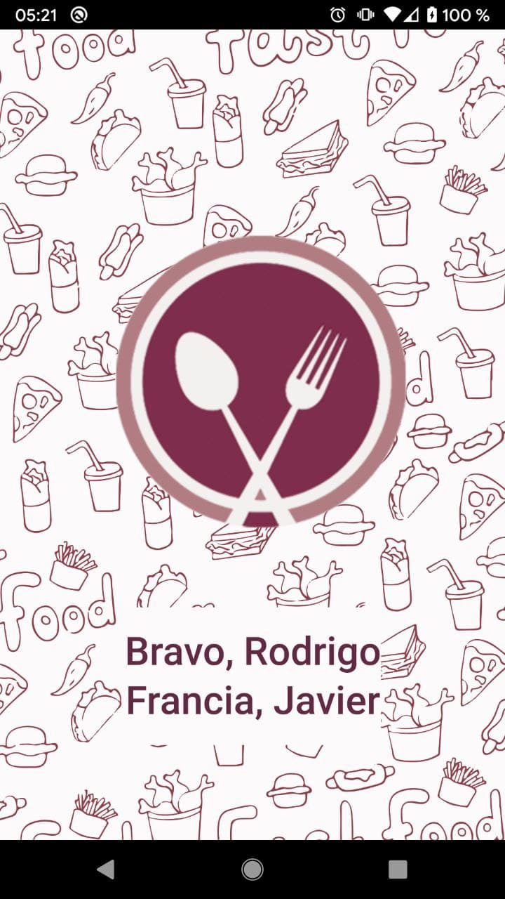
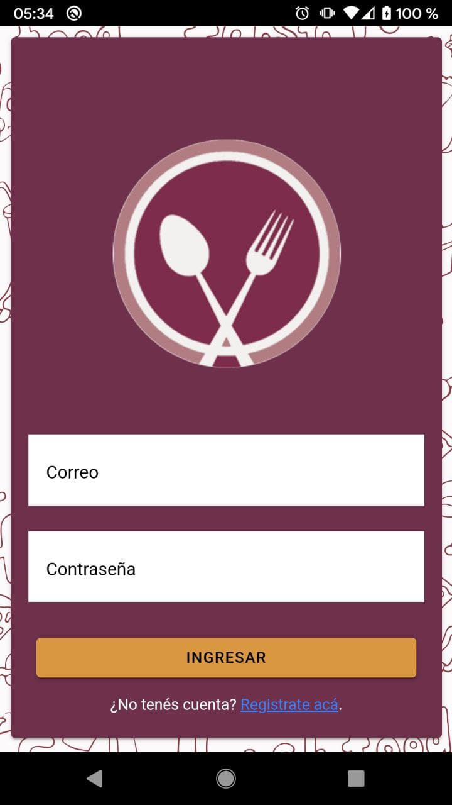
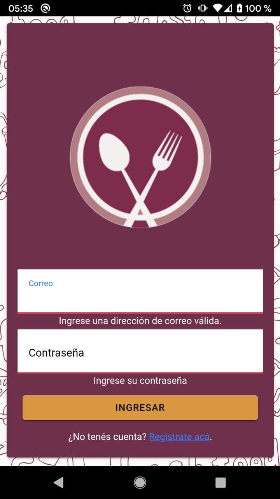
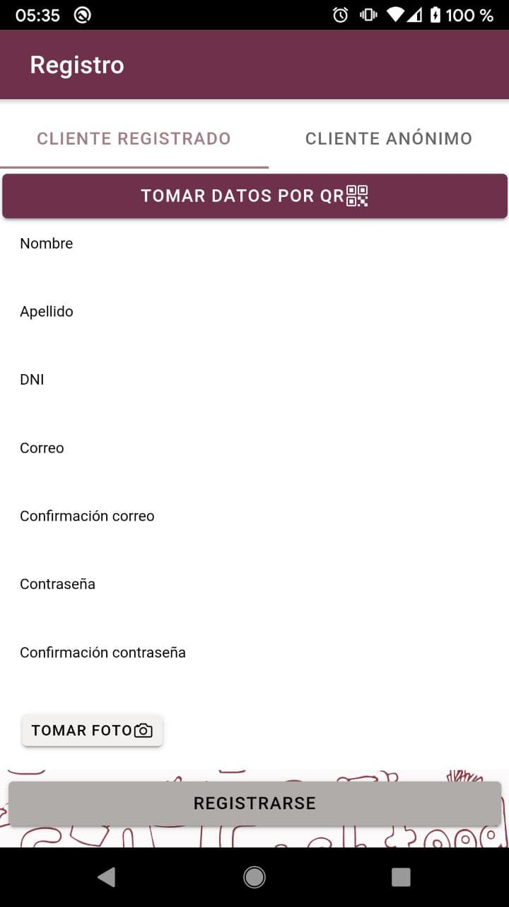
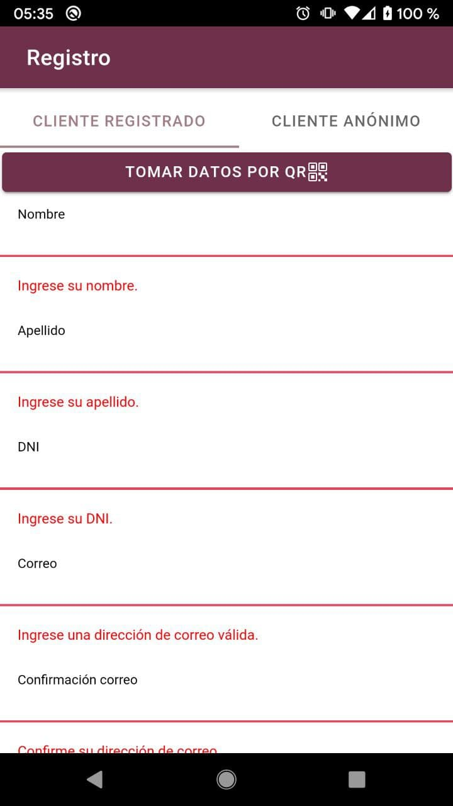
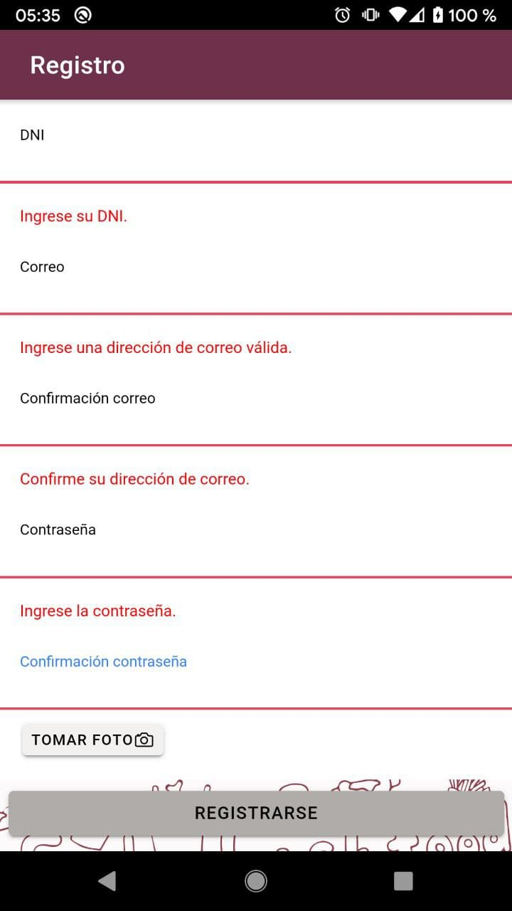
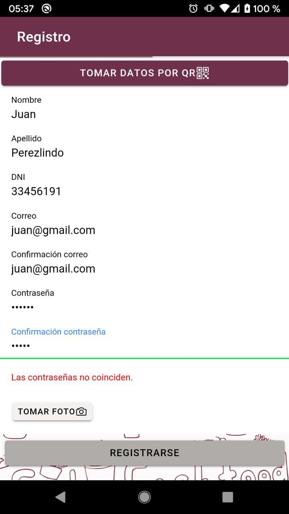
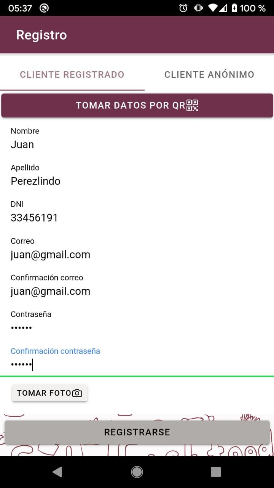

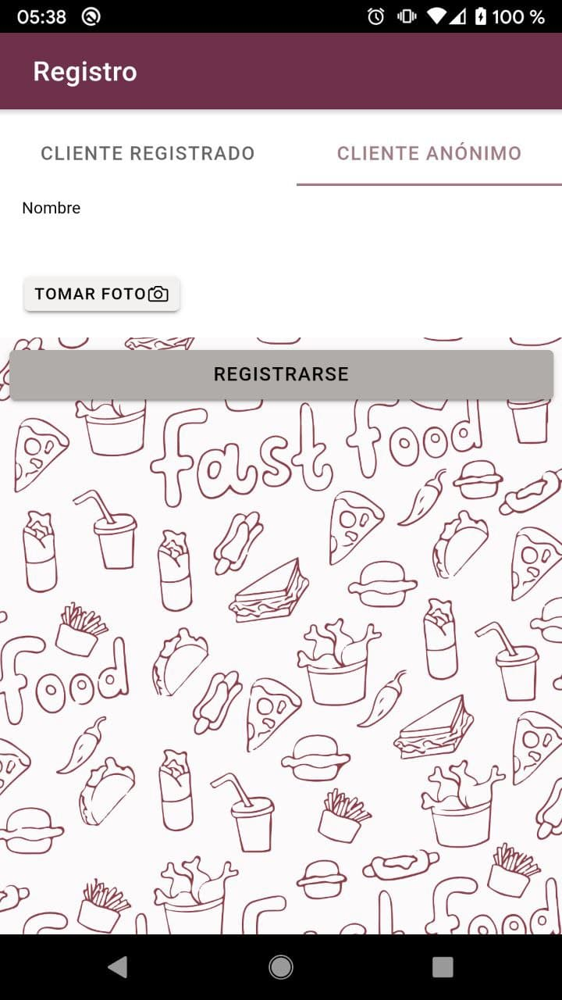
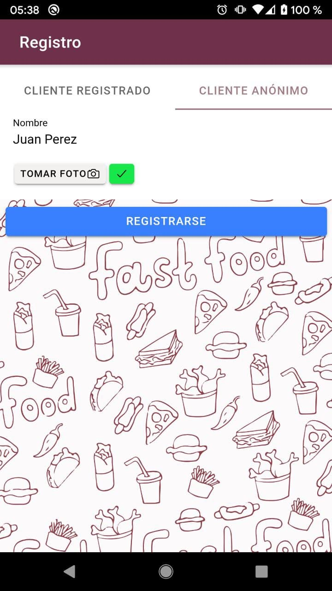
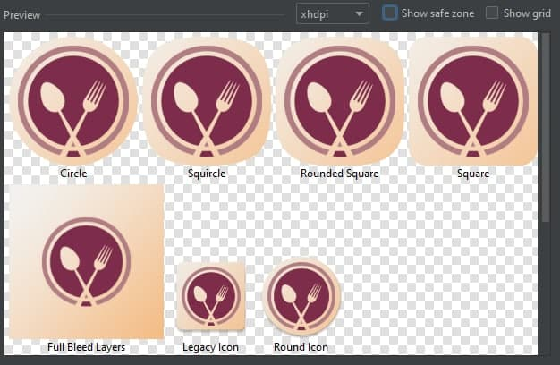


## :one: Fecha - Sábado 19/06 al Sábado 26/06
```
Bravo, Rodrigo
```
- [x] Correcion en login, registro.
- [x] Listado inicial para Dueño/Supervisor/Mozo.
- [x] Modo de ingreso para clientes anonimos.
- [x] Carga de producto para pruebas.

```
Francia, Javier
```
- [x] Spinner.
- [x] Investigación técnica de observables.
- [x] Api/Diseño/Uso de mails para aceptados y rechazados.

```
Ambos
```
- [x] Pantalla de espera para Dueño/Supervisor/Mozo/Cliente/Anónimo.
- [x] Modelado de Pedido/Preparacion/Producto/Mesa/Usuario/Comentarios al mozo/Encuesta.
- [x] Servicios de usuarios, mesas, pedidos, preparaciones, productos. (abm, consultas).


## :three: Fecha - Viernes 26/06 al Sábado 03/07
```
Bravo, Rodrigo
```
- [x] Login correcciones
- [x] Registro anonimo - modificaciones corregidas
- [x] Registro modificaciones de front
- [x] Registro correcciones en validaciones
- [x] Listado de clientes en espera del dueño y mozo.

```
Francia, Javier
```
- [x] Spinner pantalla completa en esperas
- [x] Desactivación del botón físico de "atrás" del celular
- [x] Detalle de producto, listado de productos, pantalla de pedidos
- [x] Carrito de compras (detalle de preparaciones, lista de preparaciones)
- [x] Navbar nuevo

## :four: Fecha - Viernes 03/07 al Sábado 17/07

```
Bravo, Rodrigo
```
- [x] Pantalla de estado del pedido
- [x] Pantalla de confirmacion del pedido
- [x] Modal de pago de propina
- [x] Modal para completar encuestas
- [x] Pantalla de pago del pedido junto con su detalle.
- [x] Pantalla de confirmacion del pedido.
- [x] Pantallas a las que accede el cliente, con el flujo de QR correspondiente segun estado de su pedido.
- [x] Flujos general de la preparación del pedido
- [x] Calculo de tiempo de espera del pedido y tiempo que pasó desde que se hizo la consulta
- [x] Notificaciones toast y su funcionalidad correspondiente

```
Francia, Javier
```
- [x] Pantalla principal de gestiones a cargo del mozo
- [x] Listados del mozo:
        - Clientes con cuenta pedida
        - Entrega de pedidos
        - Validacion de usuarios anonimos
        - Validacion de pedidos
        - Consultas a responder
- [x] Investigación notificaciones push para android
- [x] Notificaciones push aplicadas a cada acción requerida.
- [x] Consulta al mozo end to end
- [x] Carrusel de fotos por productos
- [x] Pantalla con gráficos de resultados de encuestas
- [x] Listados de preparaciones para cocineros y bartenders
- [x] Flujo del pedido para los cocineros y bartenders.


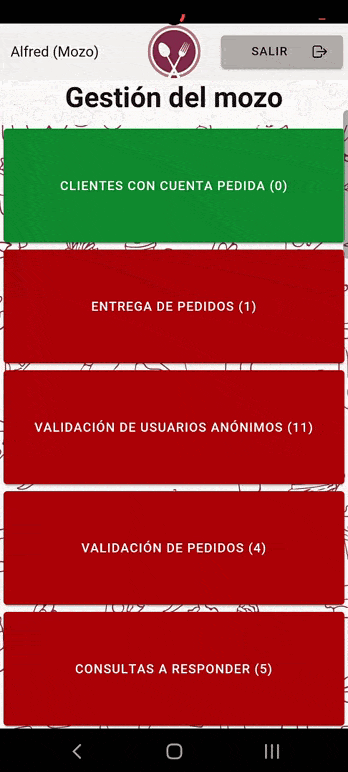
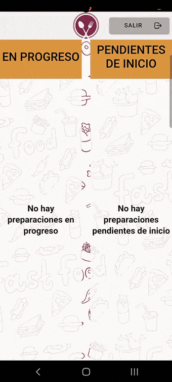

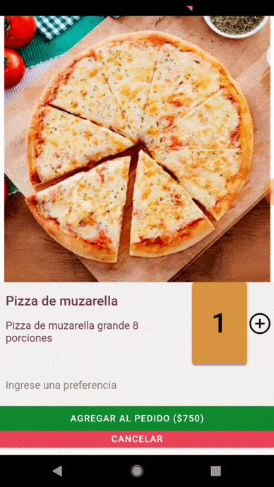
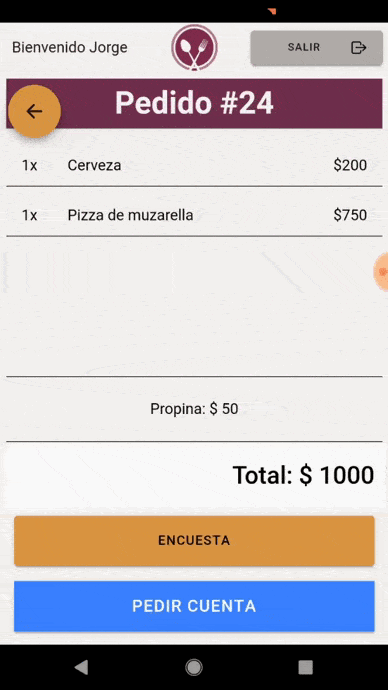
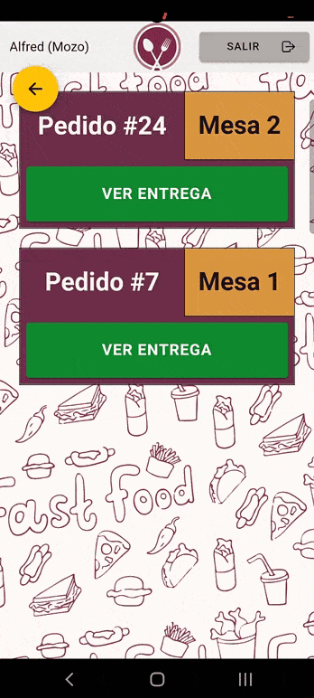


