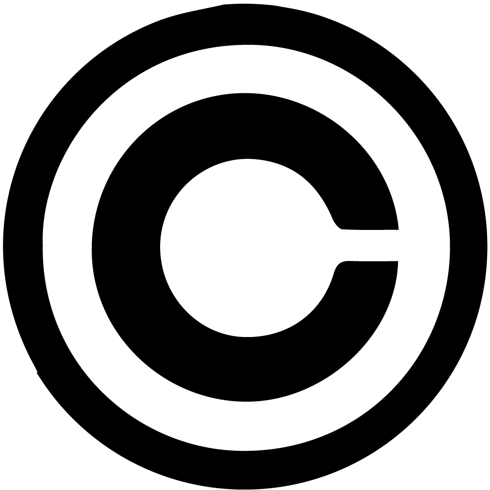
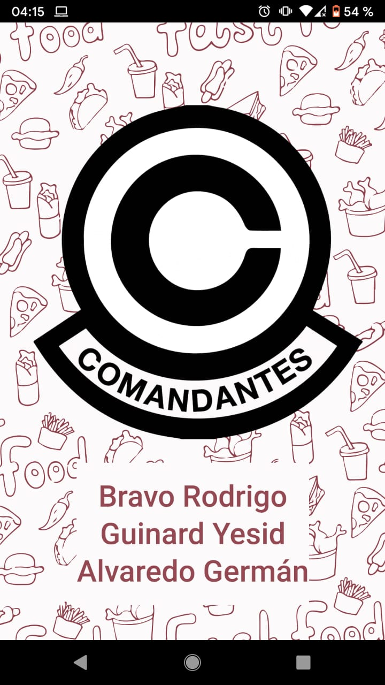
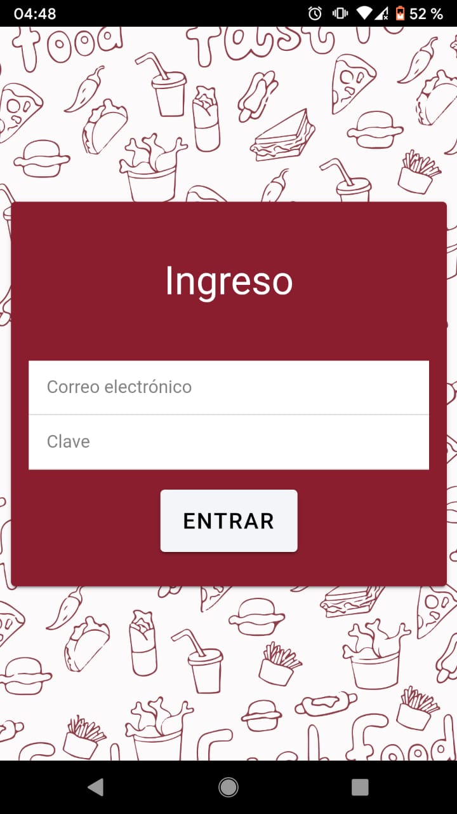

# **La Comanda** :pizza::beer:
## :computer: Práctica Profesional Supervisada 2021 1er Cuatrimestre

### :man_technologist: Desarrolladores

```
α Rodrigo Bravo
β Yesid Guinard
γ German Alvaredo
```

## :one: Fecha - Sábado 29/05 al 05/06
```
Rodrigo Bravo
```
- [x] Creación de entorno-app, repositorio
- [x] Icono, Splash animado con ícono de la aplicación y el nombre de los alumnos.
- [x] Login (solo front para esta entrega)





```
German Alvaredo
```
- [x] Creación mail empresa -> comanda.tupedido@gmail.com 


## :two: Fecha - Sábado 05/06 al 12/06

- [ ] Organizar Backlog


# Backlog

- [ ] Alta de dueño / supervisor
- [ ] Alta de empleados
- [ ] Logo Empresa
- [ ] Flujo de estado de un pedido.
- [ ] Alta de Mesa
- [ ] Alta de pedido
- [ ] Validación de datos, en todos los formularios. (TODOS LOS DATOS, EN TODOS LOS FORMULARIOS).
- [ ] Todo error o información mostrarlo con distintas ventanas. (DISTINTAS, ¡NO alerts!).
- [ ] Enviar mail (investigar como enviar mail desde TS + template - ver punto 3)
- [ ] plugin sonido, vibracion
- [ ] plugin notificaciones push - fmc
- [ ] plugin QR, Camara, QR-Dni
- [ ] Generación de documentos (JSON / EXCEL).
- [ ] Cargado de datos por medio de un archivo (JSON / EXCEL).
- [ ] Pantalla tomar pedido
- [ ] Diseño/Lectura Qr de ingreso al local
- [ ] Diseño/Lectura Qr de la mesa
- [ ] Diseño/Lectura Qr de propina
- [ ] Alta de productos (platos y bebidas)
- [ ] Alta de cliente
- [ ] Sonidos distintos al iniciar y cerrar la aplicación

- [ ] Encuestas ->  Formulario, camara, gráficos
   * Clientes
   * Empleado
   * Supervisor

- [ ] Gestión Pedir Platos y bebidas
- [ ] Gestión tomar pedido
- [ ] Gestión reservas Alta/listado reservas disponible
- [ ] Push Notification - Pedir mesa
- [ ] Push Notification - Pedido de platos y bebidas / cierre de cuenta
- [ ] Push Notification - Hacer reservas agendadas / Delivery