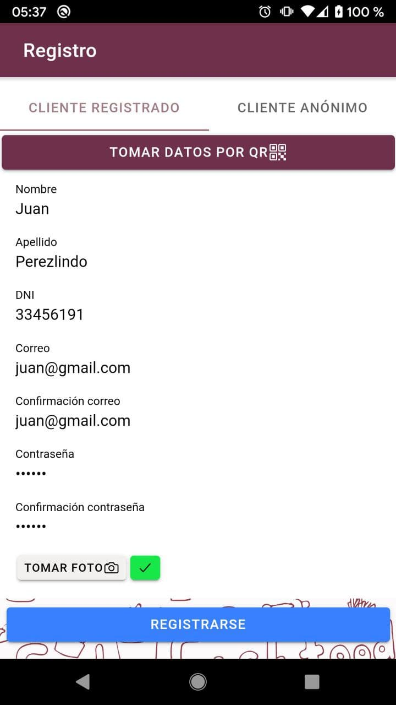

# **La Comanda** :pizza::beer:
## :computer: Práctica Profesional Supervisada 2021 1er Cuatrimestre

### :man_technologist: Desarrolladores

```
α Bravo, Rodrigo
β Francia, Javier
```

## :one: Fecha - Sábado 18/06 al 19/06
```
Rodrigo Bravo
```
- [x] 
- [x] 
- [x] 





```
Francia, Javier
```
- [x] Creación mail empresa -> comanda.tupedido@gmail.com 


##
# :books: Backlog

- [ ] Flujo de estado de un pedido.
- [ ] Alta de Mesa
- [ ] Alta de pedido
- [ ] Validación de datos, en todos los formularios. (TODOS LOS DATOS, EN TODOS LOS FORMULARIOS).
- [ ] Todo error o información mostrarlo con distintas ventanas. (DISTINTAS, ¡NO alerts!).
- [ ] plugin sonido, vibracion